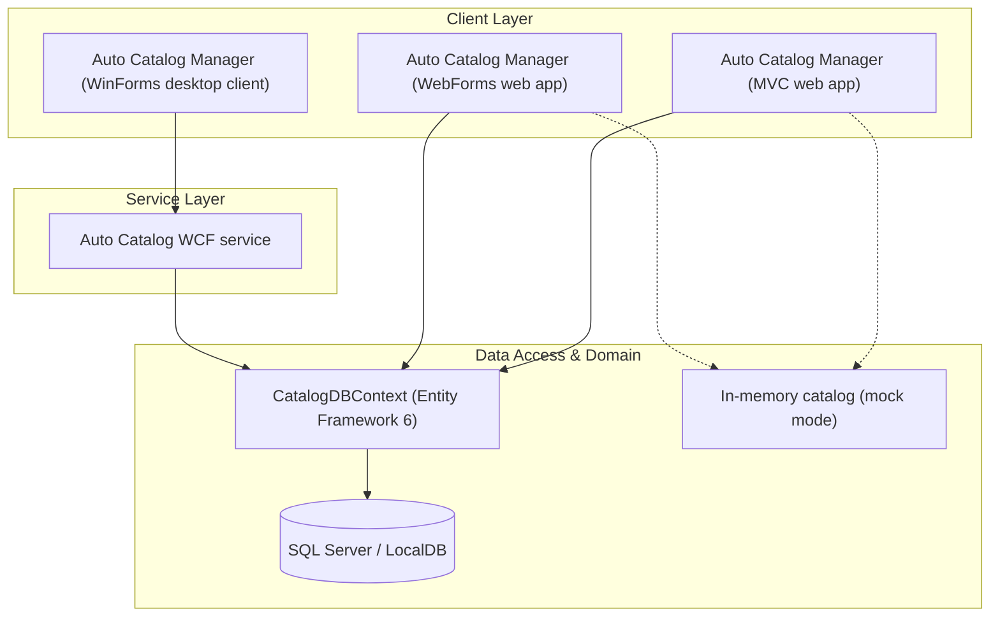

# carCatalogModernizing - Automotive catalog apps on .NET Framework (ASP.NET MVC, WebForms, WCF + WinForms)

This repo contains three sample back-office automotive catalog applications built on .NET Framework:

- **ASP.NET MVC 5** web app — `CarCatalogLegacyMVCSolution/CarCatalogLegacyMVC.sln`
- **ASP.NET WebForms** web app — `CarCatalogLegacyWebFormsSolution/CarCatalogLegacyWebForms.sln`
- **N-Tier app** — a WCF service with a WinForms desktop client — `CarCatalogLegacyNTier/CarCatalogLegacyNTier.sln`

## What the apps do

Each app is the internal back-office of a car maker/dealer group (an "Auto Catalog Manager") so employees can update the vehicle catalog: sports cars, GTs, SUVs and spare parts from fictional marques such as Velocari, Toranti, Nordwerk and Aurelia. They are CRUD applications over a SQL Server database.

The catalog domain is modelled with three entities: `CatalogBrand` (the marque), `CatalogType` (the vehicle/part category) and `CatalogItem` (the vehicle or part itself, with price, stock and picture).

The MVC and WebForms apps are nearly identical in UI and business features; both exist so the same application can be compared across the two technologies.

## Architecture

The three clients are independent applications over the same catalog domain: the two web apps talk to the database directly, while the desktop client goes through the WCF service.

### WinForms + WCF application

The WinForms client is a catalog/inventory app that reads and writes through a WCF service. Read more about it [here](./winforms-wcf.md).

## Running the apps

Open a solution in Visual Studio on Windows (or build it with `msbuild`), restore the NuGet packages and run it with IIS Express. For the N-Tier sample, start the WCF service before the WinForms client.

Autofac wires up the dependencies in each app (`Modules/ApplicationModule.cs`), and `CatalogDBContext` (Entity Framework) provides persistence, with Hi-Lo sequences generating the catalog ids.

### Mock-data or a real SQL Server database

Every app can either connect to SQL Server or serve an in-memory catalog when no database is available — useful for testing and demos. The choice is per app in its `Web.config`/`App.config`:

- `UseMockData` — `true` serves the in-memory catalog, `false` uses SQL Server.
- `UseCustomizationData` — `true` seeds the catalog from the CSV files and pictures zip in the app's `Setup` folder instead of `Models/Infrastructure/PreconfiguredData.cs`, so brands, types and items can be changed without recompiling.

## Modernization foundation (.NET 8)

`CarCatalog.sln` at the repo root is the .NET 8 base for the modernization work; the three legacy solutions keep running unchanged.

- `src/Catalog.Domain` — unified catalog entities (`CatalogItem`, `CatalogBrand`, `CatalogType`, plus the WCF-only `CatalogItemsStock` and `DiscountItem`).
- `src/Catalog.Application` — the canonical `ICatalogService`, the union of the web apps' contract and the WCF contract.
- `src/Catalog.Infrastructure` — EF Core `CatalogDbContext` over the same `Catalog`/`CatalogBrand`/`CatalogType` tables (ids come from identity columns instead of the Hi-Lo generator) and the `CatalogService` implementation.
- `tests/Catalog.Application.Tests` — xUnit characterization tests of the catalog service against the EF Core in-memory provider.

Package versions are centrally managed in `Directory.Packages.props`. Build and test on any platform with `dotnet build CarCatalog.sln` and `dotnet test CarCatalog.sln`.
